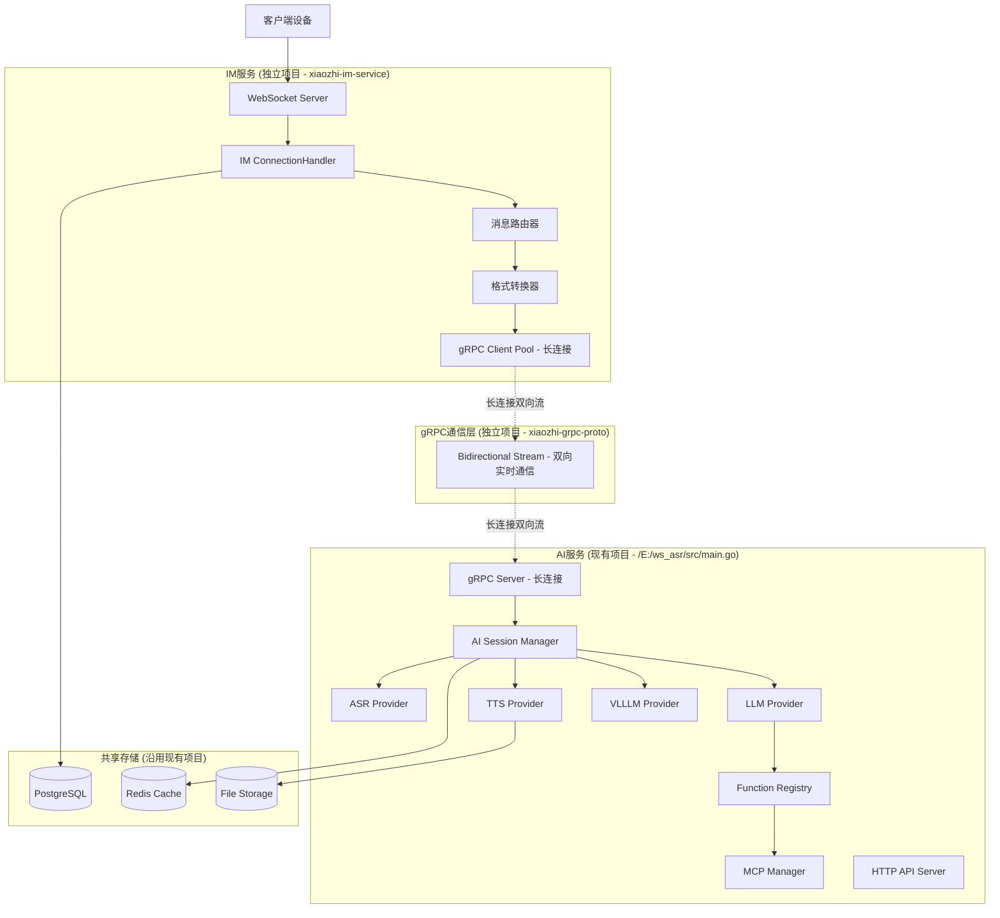
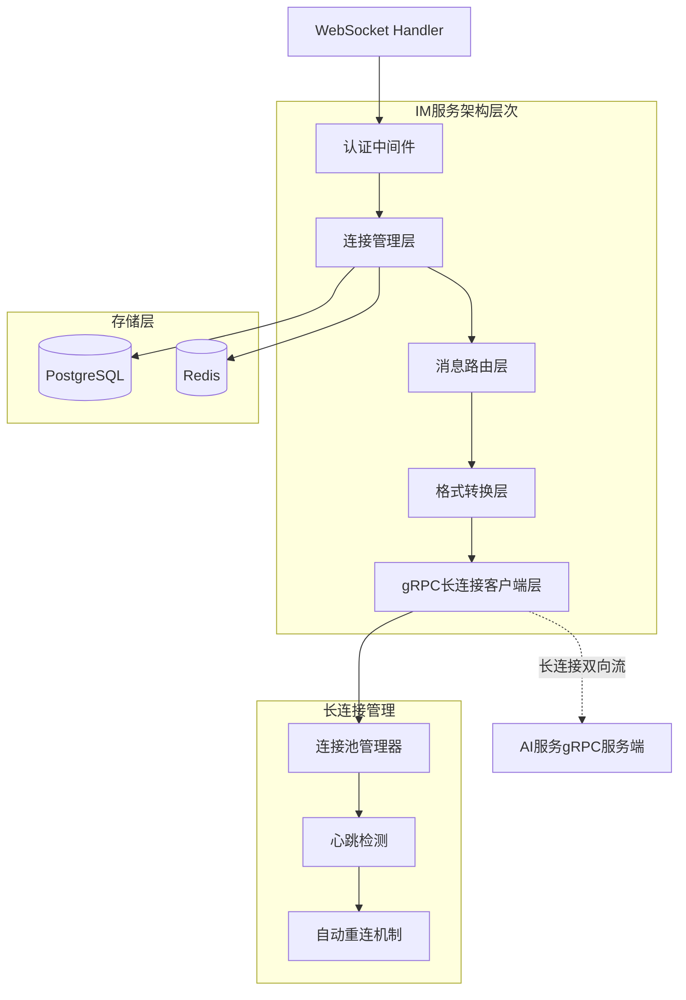
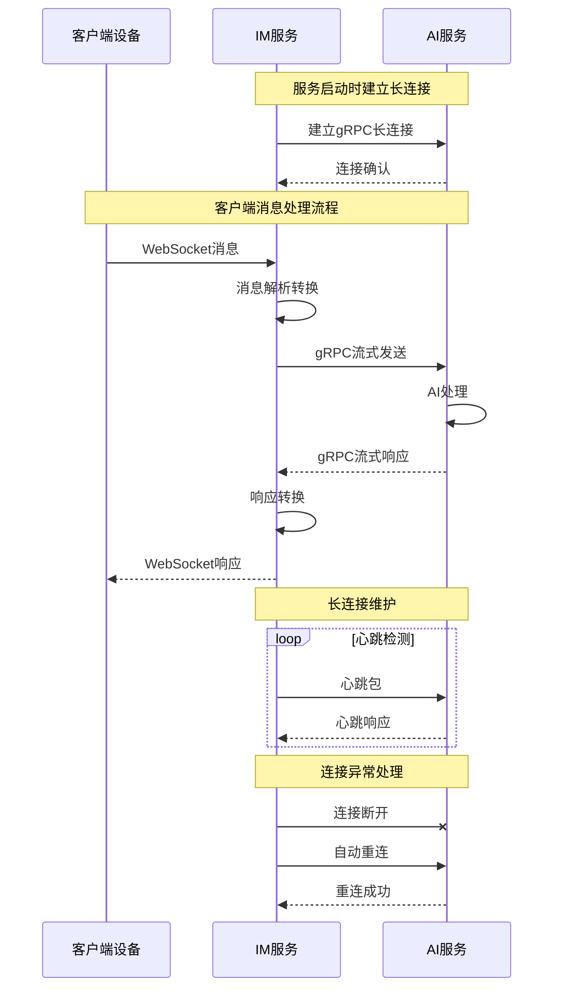
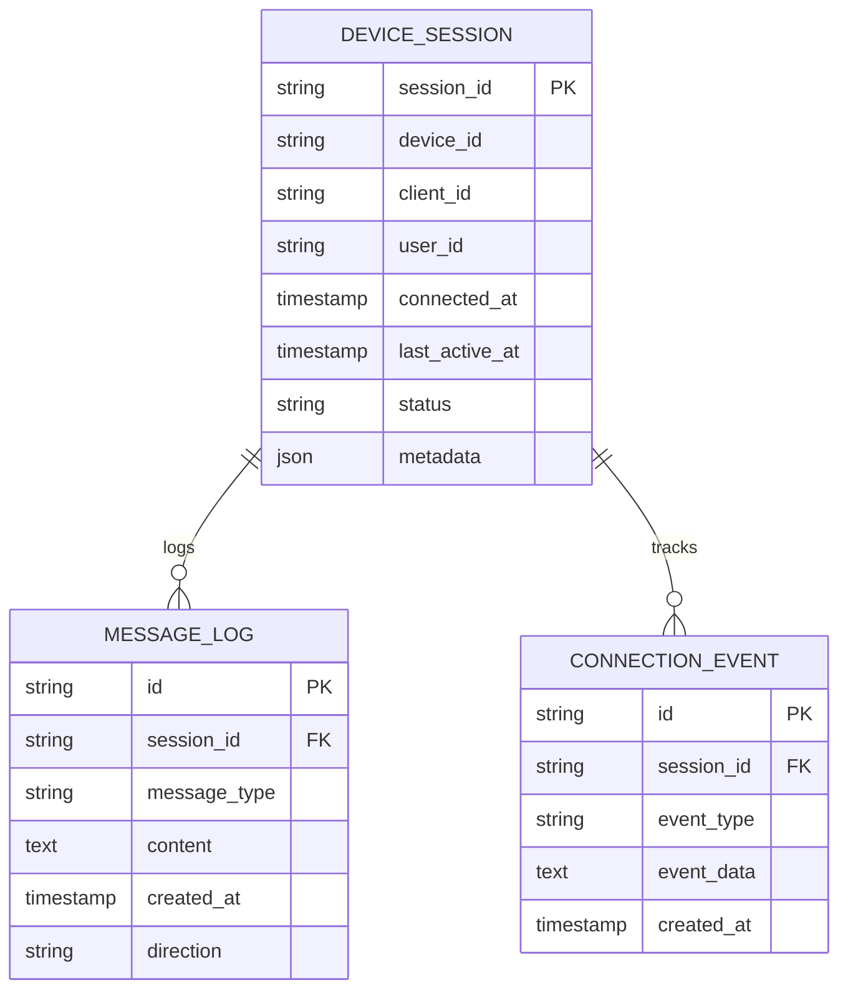

# IM服务技术架构文档

## 1. Architecture design



## 2. Technology Description

* Frontend: 无（纯后端服务）

* Backend: Go\@1.21 + Gin\@1.9 + gRPC\@1.60 + WebSocket(Gorilla)

* Database: PostgreSQL（沿用现有项目配置）

* Cache: Redis（沿用现有项目配置）

* Storage: 文件存储（沿用现有项目机制）

* Protocol: gRPC长连接双向流 + WebSocket

* Authentication: JWT Token（沿用现有认证机制）

## 3. 项目结构设计

### 3.1 gRPC协议库项目 (xiaozhi-grpc-proto)

**项目结构**：

```
xiaozhi-grpc-proto/
├── go.mod
├── go.sum
├── README.md
├── proto/
│   └── ai_service.proto          # 沿用现有proto文件
├── generated/
│   └── go/
│       └── ai_service/
│           ├── ai_service.pb.go
│           └── ai_service_grpc.pb.go
└── scripts/
    └── generate.sh               # 代码生成脚本
```

**依赖管理**：

```go
module xiaozhi-grpc-proto

go 1.21

require (
    google.golang.org/grpc v1.60.0
    google.golang.org/protobuf v1.31.0
)
```

### 3.2 IM服务项目 (xiaozhi-im-service)

**项目结构**：

```
xiaozhi-im-service/
├── go.mod
├── go.sum
├── README.md
├── cmd/
│   └── server/
│       └── main.go               # 服务启动入口
├── internal/
│   ├── config/
│   │   └── config.go            # 配置管理
│   ├── handler/
│   │   ├── websocket.go         # WebSocket处理器
│   │   └── middleware.go        # 认证中间件
│   ├── service/
│   │   ├── connection.go        # 连接管理服务
│   │   ├── message.go           # 消息路由服务
│   │   └── grpc_client.go       # gRPC长连接客户端服务
│   ├── model/
│   │   └── message.go           # 消息模型定义
│   └── utils/
│       ├── logger.go            # 日志工具
│       └── converter.go         # 消息转换工具
├── pkg/
│   └── auth/
│       └── jwt.go               # JWT认证（沿用现有逻辑）
└── configs/
    └── config.yaml              # 配置文件
```

**依赖管理**：

```go
module xiaozhi-im-service

go 1.21

require (
    xiaozhi-grpc-proto v1.0.0
    github.com/gin-gonic/gin v1.9.1
    github.com/gorilla/websocket v1.5.0
    google.golang.org/grpc v1.60.0
    github.com/golang-jwt/jwt/v5 v5.0.0
    github.com/sirupsen/logrus v1.9.3
)
```

### 3.3 AI服务项目修改 (现有项目)

**修改内容**：

* 在现有 `/E:/ws_asr/src/main.go` 基础上添加gRPC长连接服务端

* 引入 `xiaozhi-grpc-proto` 协议库

* 保持现有HTTP接口不变

* 添加gRPC长连接服务启动逻辑

**新增依赖**：

```go
require (
    xiaozhi-grpc-proto v1.0.0
    // ... 现有依赖保持不变
)
```

## 4. API definitions

### 4.1 IM服务接口

#### WebSocket连接接口

**连接建立**

```
WebSocket: /ws
Headers: 
- Authorization: Bearer <JWT_TOKEN>
- Device-Id: <DEVICE_ID>
- Client-Id: <CLIENT_ID>
```

**消息格式**（完全兼容现有格式）

```json
{
  "type": "hello|listen|chat|abort|mcp|vision|image",
  "data": {...},
  "timestamp": 1640995200000
}
```

#### 健康检查接口

**健康检查**

```
GET /health
```

Response:

| Param Name   | Param Type | Description              |
| ------------ | ---------- | ------------------------ |
| status       | string     | 服务状态 (healthy/unhealthy) |
| connections  | integer    | 当前连接数                    |
| grpc\_status | string     | gRPC长连接状态                |

### 4.2 gRPC长连接双向流接口

#### AI服务通信协议

**服务定义**

```protobuf
service AIService {
  // 双向流聊天接口 - 长连接实时通信
  rpc ChatStream(stream ChatRequest) returns (stream ChatResponse);
}
```

**长连接特性**：

* **持久连接**：IM服务与AI服务建立长期gRPC连接，避免频繁建立/断开连接的开销

* **双向实时通信**：支持同时发送请求和接收响应，实现真正的实时交互

* **连接复用**：多个WebSocket客户端可以复用同一个gRPC长连接

* **自动重连**：连接断开时自动重新建立连接，保证服务可用性

Request:

| Param Name  | Param Type  | isRequired | Description              |
| ----------- | ----------- | ---------- | ------------------------ |
| message\_id | string      | true       | 消息唯一标识                   |
| device\_id  | string      | true       | 设备ID                     |
| type        | MessageType | true       | 消息类型枚举                   |
| content     | oneof       | true       | 消息内容（hello/listen/chat等） |
| timestamp   | int64       | true       | 时间戳                      |

Response:

| Param Name  | Param Type   | Description                         |
| ----------- | ------------ | ----------------------------------- |
| message\_id | string       | 响应消息ID                              |
| device\_id  | string       | 设备ID                                |
| type        | ResponseType | 响应类型（text/audio/image/error/status） |
| content     | oneof        | 响应内容                                |
| timestamp   | int64        | 时间戳                                 |

## 5. Server architecture diagram



## 6. gRPC长连接双向通信方案

### 6.1 长连接架构设计



### 6.2 长连接实现要点

#### IM服务端（gRPC客户端）

```go
type GRPCClientService struct {
    conn       *grpc.ClientConn
    client     ai_service.AIServiceClient
    stream     ai_service.AIService_ChatStreamClient
    reconnect  chan struct{}
    logger     *logrus.Logger
}

// 建立长连接
func (s *GRPCClientService) Connect() error {
    // 建立gRPC连接
    conn, err := grpc.Dial(s.address, 
        grpc.WithInsecure(),
        grpc.WithKeepaliveParams(keepalive.ClientParameters{
            Time:                10 * time.Second, // 心跳间隔
            Timeout:             3 * time.Second,  // 心跳超时
            PermitWithoutStream: true,
        }))
    
    // 建立双向流
    stream, err := s.client.ChatStream(context.Background())
    
    // 启动接收协程
    go s.receiveLoop()
    
    // 启动心跳检测
    go s.heartbeatLoop()
    
    return nil
}

// 双向流接收循环
func (s *GRPCClientService) receiveLoop() {
    for {
        response, err := s.stream.Recv()
        if err != nil {
            s.handleReconnect()
            continue
        }
        // 处理响应消息
        s.handleResponse(response)
    }
}
```

#### AI服务端（gRPC服务端）

```go
type AIGRPCServer struct {
    ai_service.UnimplementedAIServiceServer
    sessions map[string]*Session
    logger   *logrus.Logger
}

// 双向流处理
func (s *AIGRPCServer) ChatStream(stream ai_service.AIService_ChatStreamServer) error {
    // 为每个连接创建会话
    sessionID := generateSessionID()
    session := &Session{
        ID:     sessionID,
        Stream: stream,
        Active: true,
    }
    
    s.sessions[sessionID] = session
    defer delete(s.sessions, sessionID)
    
    // 启动接收循环
    for {
        request, err := stream.Recv()
        if err != nil {
            return err
        }
        
        // 异步处理请求
        go s.processRequest(session, request)
    }
}
```

### 6.3 连接管理特性

1. **连接池管理**：

   * 维护多个gRPC长连接以支持负载均衡

   * 连接复用，减少连接建立开销

   * 连接状态监控和管理

2. **心跳检测**：

   * 定期发送心跳包检测连接状态

   * 检测到连接异常时触发重连机制

   * 支持可配置的心跳间隔和超时时间

3. **自动重连**：

   * 连接断开时自动尝试重新连接

   * 指数退避重连策略，避免频繁重连

   * 重连成功后恢复消息处理

4. **流量控制**：

   * 支持背压机制，防止消息积压

   * 消息队列缓冲，保证消息不丢失

   * 优雅的连接关闭和资源清理

## 7. Data model

### 7.1 Data model definition



### 7.2 Data Definition Language

**设备会话表 (device\_sessions)**

```sql
-- 创建设备会话表
CREATE TABLE device_sessions (
    session_id VARCHAR(255) PRIMARY KEY,
    device_id VARCHAR(255) NOT NULL,
    client_id VARCHAR(255),
    user_id VARCHAR(255) NOT NULL,
    connected_at TIMESTAMP WITH TIME ZONE DEFAULT NOW(),
    last_active_at TIMESTAMP WITH TIME ZONE DEFAULT NOW(),
    status VARCHAR(20) DEFAULT 'active' CHECK (status IN ('active', 'inactive', 'disconnected')),
    metadata JSONB DEFAULT '{}',
    created_at TIMESTAMP WITH TIME ZONE DEFAULT NOW(),
    updated_at TIMESTAMP WITH TIME ZONE DEFAULT NOW()
);

-- 创建索引
CREATE INDEX idx_device_sessions_device_id ON device_sessions(device_id);
CREATE INDEX idx_device_sessions_user_id ON device_sessions(user_id);
CREATE INDEX idx_device_sessions_status ON device_sessions(status);
CREATE INDEX idx_device_sessions_last_active ON device_sessions(last_active_at DESC);

-- 消息日志表 (message_logs)
CREATE TABLE message_logs (
    id UUID PRIMARY KEY DEFAULT gen_random_uuid(),
    session_id VARCHAR(255) NOT NULL REFERENCES device_sessions(session_id),
    message_type VARCHAR(50) NOT NULL,
    content TEXT,
    direction VARCHAR(10) CHECK (direction IN ('inbound', 'outbound')),
    created_at TIMESTAMP WITH TIME ZONE DEFAULT NOW()
);

-- 创建索引
CREATE INDEX idx_message_logs_session_id ON message_logs(session_id);
CREATE INDEX idx_message_logs_created_at ON message_logs(created_at DESC);
CREATE INDEX idx_message_logs_type ON message_logs(message_type);

-- 连接事件表 (connection_events)
CREATE TABLE connection_events (
    id UUID PRIMARY KEY DEFAULT gen_random_uuid(),
    session_id VARCHAR(255) NOT NULL REFERENCES device_sessions(session_id),
    event_type VARCHAR(50) NOT NULL,
    event_data JSONB DEFAULT '{}',
    created_at TIMESTAMP WITH TIME ZONE DEFAULT NOW()
);

-- 创建索引
CREATE INDEX idx_connection_events_session_id ON connection_events(session_id);
CREATE INDEX idx_connection_events_created_at ON connection_events(created_at DESC);
CREATE INDEX idx_connection_events_type ON connection_events(event_type);
```

## 8. 开发流程

### 8.1 开发顺序

1. **gRPC协议库开发**

   * 完善proto文件定义

   * 生成Go代码

   * 发布为Go模块

2. **IM服务开发**

   * 引入gRPC协议库

   * 实现WebSocket处理器

   * 实现gRPC长连接客户端

   * 实现消息路由和转换

3. **AI服务改造**

   * 引入gRPC协议库

   * 实现gRPC长连接服务端

   * 集成现有AI处理逻辑

   * 保持HTTP接口不变

### 8.2 测试验证

1. **单元测试**：各模块功能测试
2. **集成测试**：IM服务与AI服务通信测试
3. **压力测试**：长连接稳定性和性能测试
4. **兼容性测试**：现有客户端兼容性验证

