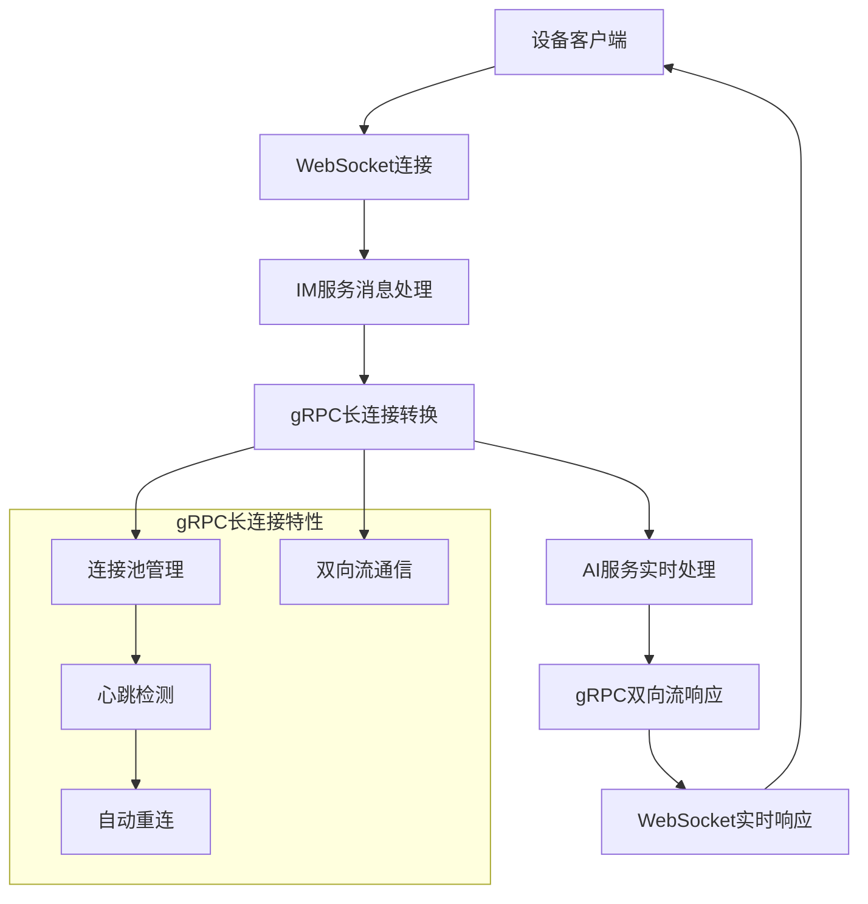

# IM服务抽象化产品需求文档

## 1. Product Overview

本项目旨在将现有的WebSocket语音助手服务抽象为独立的IM（即时通讯）服务，实现与AI服务的解耦。IM服务作为通讯中间层，负责处理客户端连接和消息路由，通过gRPC长连接与AI服务进行双向实时通信。

* 解决现有WebSocket服务与AI服务紧耦合的问题，提升系统的可维护性和扩展性

* 面向需要实时语音、文本、图片交互的智能助手应用场景

* 通过服务拆分和gRPC长连接实现更好的负载均衡和服务解耦

## 2. Core Features

### 2.1 User Roles

| Role | Registration Method   | Core Permissions    |
| ---- | --------------------- | ------------------- |
| 设备用户 | JWT Token认证（沿用现有认证机制） | 可连接IM服务，发送消息，接收AI响应 |

### 2.2 Feature Module

IM服务抽象化需求包含以下核心页面和模块：

1. **WebSocket连接服务**：客户端连接管理、消息接收与分发（唯一入口）
2. **gRPC长连接通信模块**：与AI服务的双向流实时通信
3. **消息路由模块**：消息格式转换、路由分发

### 2.3 Page Details

| Page Name     | Module Name | Feature description                                   |
| ------------- | ----------- | ----------------------------------------------------- |
| WebSocket连接服务 | 连接管理器       | 处理客户端WebSocket连接建立、维持、断开。支持设备ID、客户端ID、会话ID识别          |
| WebSocket连接服务 | 消息接收器       | 接收客户端发送的文本消息（JSON格式）、二进制音频数据（PCM/Opus）、图片数据（base64）   |
| WebSocket连接服务 | 消息分发器       | 将接收到的消息转换为gRPC格式并转发给AI服务，将AI服务响应转换为WebSocket格式返回客户端   |
| gRPC长连接通信模块   | 长连接池管理      | 管理与AI服务的gRPC长连接，支持连接复用、心跳检测和自动重连                      |
| gRPC长连接通信模块   | 双向流处理       | 实现ChatStream双向流通信，处理请求发送和响应接收的实时交互                    |
| 消息路由模块        | 消息类型处理      | 支持hello、listen、chat、abort、mcp、vision、image等消息类型的解析和路由 |
| 消息路由模块        | 格式转换器       | WebSocket JSON消息与gRPC protobuf消息之间的双向转换               |

## 3. Core Process

### 主要用户操作流程

**设备连接流程**：

1. 设备通过WebSocket连接到IM服务，携带JWT Token进行认证（沿用现有认证机制）
2. IM服务验证Token，建立设备会话，与AI服务建立gRPC长连接
3. 设备发送hello消息进行音频参数协商
4. IM服务通过长连接转发hello消息到AI服务，返回协商结果

**消息交互流程**：

1. 设备发送消息（文本/音频/图片）到IM服务
2. IM服务解析消息类型，转换为gRPC格式
3. 通过双向流长连接实时发送到AI服务进行处理
4. AI服务通过双向流实时返回处理结果（文本/音频/状态）
5. IM服务转换响应格式，通过WebSocket返回设备

## 4. 项目结构设计

### 4.1 项目拆分方案

根据需求，将系统拆分为以下独立项目：

#### 4.1.1 gRPC协议库项目（独立项目）

* **项目名称**：`xiaozhi-grpc-proto`

* **功能**：定义gRPC服务接口和消息结构

* **内容**：

  * 沿用现有的 `ai_service.proto` 文件

  * 生成Go语言的gRPC代码

  * 提供给IM服务和AI服务引入使用

* **使用方式**：作为Go module被其他项目引入

#### 4.1.2 IM服务项目（独立项目）

* **项目名称**：`xiaozhi-im-service`

* **功能**：处理WebSocket连接和消息路由

* **依赖**：引入gRPC协议库项目

* **入口**：仅提供WebSocket连接入口

* **通信特性**：与AI服务建立gRPC长连接，支持双向实时通信

#### 4.1.3 AI服务项目（现有项目）

* **项目路径**：`/E:/ws_asr/src/main.go`

* **功能**：沿用现有AI服务功能

* **修改**：添加gRPC长连接服务端支持

* **依赖**：引入gRPC协议库项目

* **特点**：保持现有HTTP接口不变，新增gRPC长连接接口

### 4.2 文件共享机制

* **存储系统**：沿用现有项目的文件存储机制

* **数据库**：沿用现有项目的数据库配置

* **配置文件**：沿用现有项目的配置管理

* **日志系统**：沿用现有项目的日志框架

* **认证系统**：沿用现有项目的JWT Token认证

## 5. 兼容性要求

### 5.1 消息格式兼容

* **完全兼容**现有WebSocket消息格式

* **完全兼容**现有音频数据格式（PCM/Opus）

* **完全兼容**现有图片数据格式（base64）

* **完全兼容**现有JSON消息结构

### 5.2 接口兼容

* **WebSocket接口**：保持现有WebSocket连接协议不变

* **HTTP接口**：AI服务的HTTP接口保持不变

* **认证机制**：沿用现有JWT Token认证，无需修改客户端

### 5.3 数据格式兼容

* **音频格式**：支持PCM、Opus等现有音频格式

* **图片格式**：支持base64编码的图片数据

* **消息类型**：支持hello、listen、chat、abort、mcp、vision、image等所有现有消息类型

## 6. 技术约束

### 6.1 开发约束

* **不开发额外HTTP接口**：IM服务仅提供WebSocket入口

* **不重新创建AI服务**：直接在现有AI服务基础上添加gRPC长连接支持

* **不额外开发文件共享**：沿用现有项目的存储和配置机制

* **独立项目开发**：IM服务和gRPC协议库作为独立项目开发

### 6.2 性能要求

* **低延迟**：消息转发延迟 < 50ms

* **高并发**：支持1000+并发WebSocket连接

* **高可用**：支持gRPC长连接自动重连和故障恢复

* **实时通信**：gRPC双向流支持实时消息推送和响应

* **资源优化**：长连接池管理，消息批处理，异步处理机制

## 7. gRPC长连接通信要求

### 7.1 长连接特性

* **持久连接**：IM服务与AI服务建立长期gRPC连接，避免频繁建立/断开连接的开销

* **双向实时通信**：支持同时发送请求和接收响应，实现真正的实时交互

* **连接复用**：多个WebSocket客户端可以复用同一个gRPC长连接

* **自动重连**：连接断开时自动重新建立连接，保证服务可用性

### 7.2 通信协议

* **双向流协议**：使用gRPC的双向流（Bidirectional Streaming）实现实时通信

* **心跳机制**：定期发送心跳包检测连接状态

* **流量控制**：支持背压机制，防止消息积压

* **错误处理**：完善的连接异常处理和恢复机制

