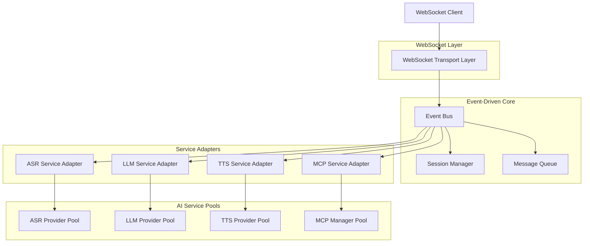
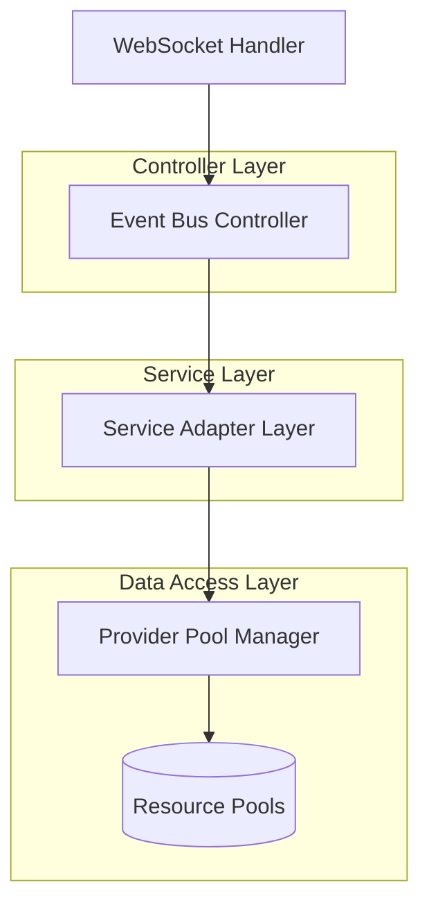
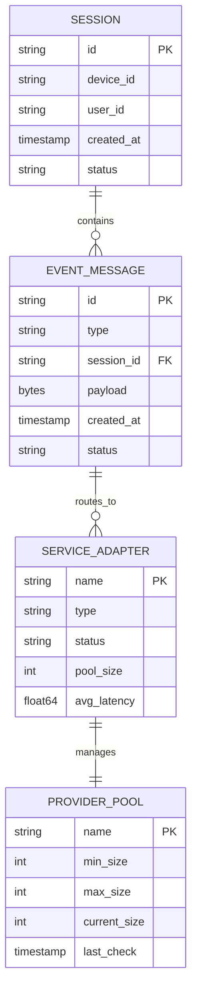

# WebSocket与AI服务解耦技术架构文档

## 1. 架构设计



## 2. 技术描述

- Frontend: 无需修改现有前端，保持WebSocket连接方式
- Backend: Go@1.21 + Gin + 内存事件总线 + 服务适配器模式
- Message Queue: 基于Go Channel的内存消息队列
- Service Pool: 现有资源池管理机制保持不变

## 3. 路由定义

| 路由 | 目的 |
|------|------|
| /ws | WebSocket连接入口，保持现有协议不变 |
| /api/event-bus/status | 事件总线状态监控接口 |
| /api/services/health | 服务健康检查接口 |
| /api/config/decoupling | 解耦配置管理接口 |

## 4. API定义

### 4.1 核心API

事件总线相关接口
```
GET /api/event-bus/status
```

Response:
| 参数名称 | 参数类型 | 描述 |
|----------|----------|------|
| queue_length | int | 当前队列长度 |
| processing_rate | float64 | 消息处理速率(msg/s) |
| error_count | int | 错误计数 |

示例:
```json
{
  "queue_length": 15,
  "processing_rate": 125.5,
  "error_count": 2
}
```

服务健康检查
```
GET /api/services/health
```

Response:
| 参数名称 | 参数类型 | 描述 |
|----------|----------|------|
| services | array | 服务状态列表 |
| overall_status | string | 整体健康状态 |

示例:
```json
{
  "services": [
    {"name": "asr", "status": "healthy", "latency": 45},
    {"name": "llm", "status": "healthy", "latency": 120},
    {"name": "tts", "status": "warning", "latency": 200}
  ],
  "overall_status": "healthy"
}
```

## 5. 服务器架构图



## 6. 数据模型

### 6.1 数据模型定义



### 6.2 数据定义语言

事件消息表 (event_messages) - 内存结构
```go
// EventMessage 事件消息结构
type EventMessage struct {
    ID        string    `json:"id"`
    Type      string    `json:"type"`      // "asr", "llm", "tts", "mcp"
    SessionID string    `json:"session_id"`
    Payload   []byte    `json:"payload"`
    CreatedAt time.Time `json:"created_at"`
    Status    string    `json:"status"`    // "pending", "processing", "completed", "failed"
}

// ServiceAdapter 服务适配器结构
type ServiceAdapter struct {
    Name       string        `json:"name"`
    Type       string        `json:"type"`
    Status     string        `json:"status"`
    PoolSize   int          `json:"pool_size"`
    AvgLatency time.Duration `json:"avg_latency"`
}

// EventBus 事件总线结构
type EventBus struct {
    channels map[string]chan *EventMessage
    adapters map[string]*ServiceAdapter
    mutex    sync.RWMutex
}
```

会话管理表 (sessions) - 内存结构
```go
// Session 会话信息结构
type Session struct {
    ID        string            `json:"id"`
    DeviceID  string            `json:"device_id"`
    UserID    string            `json:"user_id"`
    CreatedAt time.Time         `json:"created_at"`
    Status    string            `json:"status"`
    Context   map[string]interface{} `json:"context"`
}

// SessionManager 会话管理器
type SessionManager struct {
    sessions map[string]*Session
    mutex    sync.RWMutex
}
```

初始化数据
```go
// 初始化事件总线
func NewEventBus() *EventBus {
    return &EventBus{
        channels: map[string]chan *EventMessage{
            "asr": make(chan *EventMessage, 100),
            "llm": make(chan *EventMessage, 100),
            "tts": make(chan *EventMessage, 100),
            "mcp": make(chan *EventMessage, 100),
        },
        adapters: make(map[string]*ServiceAdapter),
    }
}
```