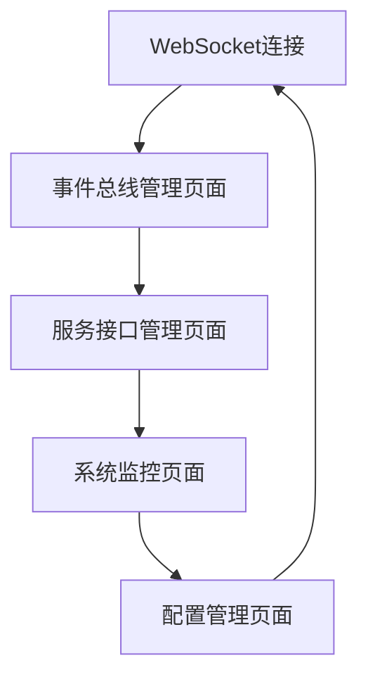

# WebSocket与AI服务解耦方案产品需求文档

## 1. 产品概述

本项目旨在对现有高度耦合的WebSocket语音助手服务进行架构重构，通过引入轻量级事件总线和标准化接口，实现WebSocket服务与AI服务（ASR、LLM、TTS、MCP）的解耦，提升系统的可维护性、可扩展性和稳定性。

该解决方案采用渐进式重构策略，最小化代码修改量，确保业务连续性的同时实现架构优化。通过内存消息队列和事件驱动架构，保持实时语音处理的性能要求。

## 2. 核心功能

### 2.1 用户角色

| 角色 | 注册方法 | 核心权限 |
|------|----------|----------|
| 系统管理员 | 内部账号 | 监控系统性能、配置服务参数、查看系统日志 |
| 开发人员 | 内部账号 | 访问开发接口、调试服务状态、部署新版本 |
| 最终用户 | WebSocket连接 | 使用语音助手功能、进行多模态交互 |

### 2.2 功能模块

我们的解耦方案包含以下主要模块：

1. **事件总线管理页面**：事件路由配置、消息队列监控、性能指标展示
2. **服务接口管理页面**：标准化接口定义、服务注册发现、健康检查状态
3. **系统监控页面**：实时性能监控、错误日志分析、服务依赖关系图
4. **配置管理页面**：解耦参数配置、服务切换控制、A/B测试管理

### 2.3 页面详情

| 页面名称 | 模块名称 | 功能描述 |
|----------|----------|----------|
| **事件总线管理页面** | 事件路由配置 | 配置事件类型与处理器的映射关系，支持动态路由规则修改 |
| **事件总线管理页面** | 消息队列监控 | 实时显示队列长度、处理速度、积压情况，支持队列清理和重置 |
| **事件总线管理页面** | 性能指标展示 | 展示事件处理延迟、吞吐量、错误率等关键性能指标 |
| **服务接口管理页面** | 接口定义管理 | 管理标准化接口规范，支持接口版本控制和兼容性检查 |
| **服务接口管理页面** | 服务注册发现 | 显示已注册服务列表，支持服务动态注册和注销 |
| **服务接口管理页面** | 健康检查状态 | 监控各AI服务健康状态，支持自动故障转移和手动服务切换 |
| **系统监控页面** | 实时性能监控 | 监控CPU、内存、网络等系统资源使用情况 |
| **系统监控页面** | 错误日志分析 | 收集和分析系统错误日志，提供错误趋势和根因分析 |
| **系统监控页面** | 服务依赖关系图 | 可视化展示服务间依赖关系，支持依赖链路追踪 |
| **配置管理页面** | 解耦参数配置 | 配置事件总线参数、队列大小、超时时间等关键参数 |
| **配置管理页面** | 服务切换控制 | 支持在线切换不同AI服务提供者，实现无缝服务升级 |
| **配置管理页面** | A/B测试管理 | 配置和管理不同解耦策略的A/B测试，评估性能影响 |

## 3. 核心流程

### 管理员流程
管理员通过系统监控页面查看整体系统状态，在事件总线管理页面配置路由规则，通过配置管理页面调整系统参数，确保解耦后的系统稳定运行。

### 开发人员流程  
开发人员通过服务接口管理页面定义和维护标准化接口，在配置管理页面进行A/B测试配置，通过系统监控页面分析性能数据，持续优化解耦方案。

### 系统自动化流程
系统自动进行服务健康检查，当检测到服务异常时触发故障转移，通过事件总线路由消息到备用服务，确保用户体验不受影响。

## 4. 用户界面设计

### 4.1 设计风格

- **主色调**：深蓝色(#1e3a8a)作为主色，浅蓝色(#3b82f6)作为辅助色
- **按钮样式**：圆角矩形按钮，支持悬停和点击状态变化
- **字体**：系统默认字体，标题使用16px，正文使用14px，说明文字使用12px
- **布局风格**：卡片式布局，顶部导航栏，左侧功能菜单，主内容区域采用网格布局
- **图标风格**：使用简洁的线性图标，支持状态指示和交互反馈

### 4.2 页面设计概览

| 页面名称 | 模块名称 | UI元素 |
|----------|----------|--------|
| **事件总线管理页面** | 事件路由配置 | 表格展示路由规则，支持行内编辑，配色使用蓝色系，包含添加/删除按钮 |
| **事件总线管理页面** | 消息队列监控 | 实时图表显示队列状态，使用绿色表示正常，红色表示异常，支持自动刷新 |
| **服务接口管理页面** | 接口定义管理 | 树形结构展示接口层级，支持拖拽排序，使用代码高亮显示接口定义 |
| **服务接口管理页面** | 健康检查状态 | 状态指示灯显示服务健康度，绿色正常/黄色警告/红色异常，支持一键重启 |
| **系统监控页面** | 实时性能监控 | 仪表盘样式展示关键指标，使用渐变色彩，支持时间范围选择和数据导出 |
| **配置管理页面** | 解耦参数配置 | 表单式配置界面，支持参数验证和实时预览，使用标签页分组管理不同类型参数 |

### 4.3 响应式设计

系统采用桌面优先的响应式设计，支持1920x1080及以上分辨率的最佳显示效果。在较小屏幕上，左侧菜单可折叠，表格支持横向滚动，图表自适应容器大小。不考虑移动端适配，专注于管理后台的桌面使用体验。