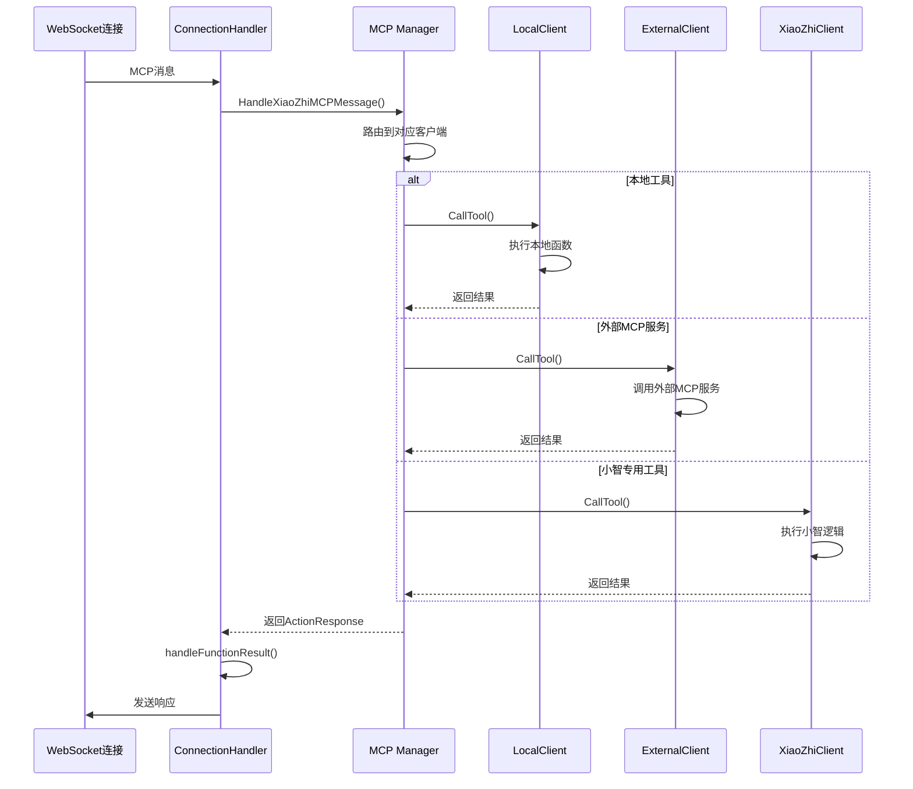
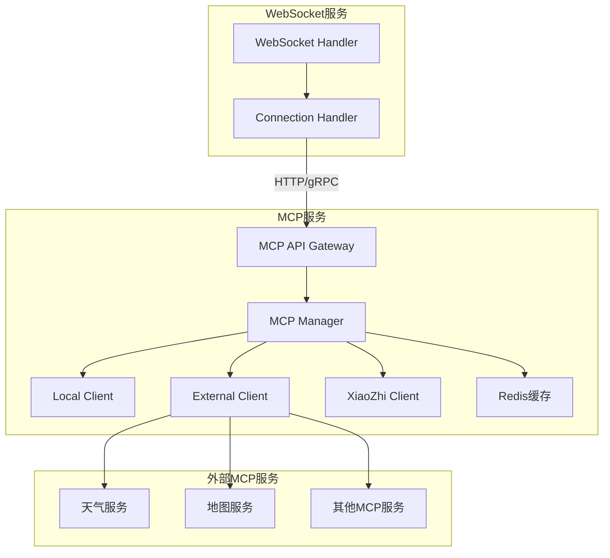

# MCP服务抽象实施指南

## 📋 项目概述

**目标**: 将当前WebSocket服务中的MCP（Multi-Client Protocol）功能抽象为独立的微服务  
**优先级**: ⭐⭐⭐⭐⭐ (最高优先级)  
**预计工期**: 2-3周  
**风险等级**: 低风险  

## 🔍 当前架构分析

### 现有MCP实现结构

```
src/core/
├── mcp/
│   ├── manager.go          # MCP管理器 - 核心协调组件
│   ├── client.go           # 外部MCP客户端
│   ├── local_client.go     # 本地MCP客户端
│   ├── xiaozhi_client.go   # 小智专用MCP客户端
│   ├── local_mcp_tools.go  # 本地MCP工具实现
│   └── interface.go        # MCP接口定义
├── connection.go           # 连接处理器
├── connection_handlemcp.go # MCP消息处理
└── connection_handlemsg.go # 消息分发
```

### 当前调用链路



### 核心组件分析

#### 1. MCP Manager (manager.go)
**职责**:
- 管理多个MCP客户端实例
- 工具注册和路由
- 连接绑定和生命周期管理
- 消息处理和结果转换

**关键方法**:
```go
// 绑定WebSocket连接
BindConnection(conn Conn, fh FunctionRegistryInterface, params interface{}) error

// 执行MCP工具
ExecuteTool(ctx context.Context, toolName string, arguments map[string]interface{}) (interface{}, error)

// 处理小智MCP消息
HandleXiaoZhiMCPMessage(msgMap map[string]interface{}) error

// 检查是否为MCP工具
IsMCPTool(toolName string) bool
```

#### 2. MCP客户端接口 (interface.go)
```go
type MCPClient interface {
    Start(ctx context.Context) error
    Stop()
    HasTool(name string) bool
    GetAvailableTools() []openai.Tool
    CallTool(ctx context.Context, name string, args map[string]interface{}) (interface{}, error)
    IsReady() bool
    ResetConnection() error
}
```

#### 3. 本地MCP客户端 (local_client.go)
**特点**:
- 实现本地工具函数（播放音乐、切换语音、角色切换等）
- 无需网络调用，性能最优
- 工具注册通过配置文件驱动

#### 4. 外部MCP客户端 (client.go)
**特点**:
- 支持stdio和SSE两种连接方式
- 动态工具发现和注册
- 连接状态管理和重连机制

## 🎯 目标架构设计

### 独立MCP服务架构



### 服务接口设计

#### HTTP API接口

```yaml
# MCP服务API规范
openapi: 3.0.0
info:
  title: MCP Service API
  version: 1.0.0

paths:
  /mcp/tools:
    get:
      summary: 获取所有可用工具
      responses:
        200:
          description: 工具列表
          content:
            application/json:
              schema:
                type: object
                properties:
                  tools:
                    type: array
                    items:
                      $ref: '#/components/schemas/Tool'

  /mcp/tools/{toolName}/execute:
    post:
      summary: 执行指定工具
      parameters:
        - name: toolName
          in: path
          required: true
          schema:
            type: string
      requestBody:
        required: true
        content:
          application/json:
            schema:
              type: object
              properties:
                arguments:
                  type: object
                session_id:
                  type: string
                device_id:
                  type: string
      responses:
        200:
          description: 执行结果
          content:
            application/json:
              schema:
                $ref: '#/components/schemas/ExecutionResult'

  /mcp/sessions/{sessionId}/bind:
    post:
      summary: 绑定会话
      parameters:
        - name: sessionId
          in: path
          required: true
          schema:
            type: string
      requestBody:
        required: true
        content:
          application/json:
            schema:
              type: object
              properties:
                device_id:
                  type: string
                client_id:
                  type: string
                vision_url:
                  type: string
      responses:
        200:
          description: 绑定成功

components:
  schemas:
    Tool:
      type: object
      properties:
        name:
          type: string
        description:
          type: string
        input_schema:
          type: object
    
    ExecutionResult:
      type: object
      properties:
        success:
          type: boolean
        action:
          type: string
          enum: [none, response, call_handler, req_llm, error]
        result:
          type: object
        response:
          type: string
```

#### gRPC接口定义

```protobuf
syntax = "proto3";

package mcp;

service MCPService {
    // 获取可用工具列表
    rpc GetTools(GetToolsRequest) returns (GetToolsResponse);
    
    // 执行工具
    rpc ExecuteTool(ExecuteToolRequest) returns (ExecuteToolResponse);
    
    // 绑定会话
    rpc BindSession(BindSessionRequest) returns (BindSessionResponse);
    
    // 处理小智MCP消息
    rpc HandleXiaoZhiMessage(HandleMessageRequest) returns (HandleMessageResponse);
}

message GetToolsRequest {
    string session_id = 1;
}

message GetToolsResponse {
    repeated Tool tools = 1;
}

message Tool {
    string name = 1;
    string description = 2;
    map<string, string> input_schema = 3;
}

message ExecuteToolRequest {
    string tool_name = 1;
    map<string, string> arguments = 2;
    string session_id = 3;
    string device_id = 4;
}

message ExecuteToolResponse {
    bool success = 1;
    ActionType action = 2;
    string result = 3;
    string response = 4;
}

enum ActionType {
    NONE = 0;
    RESPONSE = 1;
    CALL_HANDLER = 2;
    REQ_LLM = 3;
    ERROR = 4;
}

message BindSessionRequest {
    string session_id = 1;
    string device_id = 2;
    string client_id = 3;
    string vision_url = 4;
    string token = 5;
}

message BindSessionResponse {
    bool success = 1;
    string message = 2;
}

message HandleMessageRequest {
    string session_id = 1;
    map<string, string> message = 2;
}

message HandleMessageResponse {
    bool success = 1;
    string result = 2;
}
```

## 🚀 实施步骤

### 第一阶段: 准备工作 (3-5天)

#### 1.1 项目结构调整
```bash
# 创建新的MCP服务目录
mkdir -p services/mcp-service
cd services/mcp-service

# 初始化Go模块
go mod init xiaozhi-mcp-service

# 创建目录结构
mkdir -p {cmd,internal/{api,service,client,config},pkg/{types,utils},deployments}
```

#### 1.2 依赖管理
```go
// go.mod
module xiaozhi-mcp-service

go 1.21

require (
    github.com/gin-gonic/gin v1.9.1
    github.com/go-redis/redis/v8 v8.11.5
    github.com/mark3labs/mcp-go v0.1.0
    github.com/sashabaranov/go-openai v1.17.9
    google.golang.org/grpc v1.59.0
    google.golang.org/protobuf v1.31.0
)
```

#### 1.3 配置文件设计
```yaml
# config/config.yaml
server:
  http:
    port: 8080
    host: "0.0.0.0"
  grpc:
    port: 9090
    host: "0.0.0.0"

redis:
  addr: "localhost:6379"
  password: ""
  db: 0

mcp:
  local:
    enabled: true
    tools_config: "./config/local_tools.yaml"
  
  external:
    enabled: true
    servers:
      - name: "weather"
        command: "python"
        args: ["-m", "weather_mcp_server"]
        env: ["API_KEY=your_key"]
      - name: "maps"
        url: "sse://maps-service/sse"

  xiaozhi:
    enabled: true
    vision_url: "http://localhost:8081"

logging:
  level: "info"
  format: "json"
```

### 第二阶段: 核心服务开发 (5-7天)

#### 2.1 MCP服务核心实现

```go
// internal/service/mcp_service.go
package service

import (
    "context"
    "fmt"
    "sync"
    "xiaozhi-mcp-service/internal/client"
    "xiaozhi-mcp-service/pkg/types"
)

type MCPService struct {
    manager     *client.Manager
    sessions    map[string]*SessionContext
    sessionsMux sync.RWMutex
}

type SessionContext struct {
    SessionID string
    DeviceID  string
    ClientID  string
    VisionURL string
    Token     string
    CreatedAt time.Time
}

func NewMCPService(manager *client.Manager) *MCPService {
    return &MCPService{
        manager:  manager,
        sessions: make(map[string]*SessionContext),
    }
}

func (s *MCPService) GetTools(ctx context.Context, sessionID string) ([]types.Tool, error) {
    // 获取所有可用工具
    return s.manager.GetAllTools(), nil
}

func (s *MCPService) ExecuteTool(ctx context.Context, req *types.ExecuteToolRequest) (*types.ExecuteToolResponse, error) {
    // 验证会话
    session := s.getSession(req.SessionID)
    if session == nil {
        return nil, fmt.Errorf("session not found: %s", req.SessionID)
    }

    // 执行工具
    result, err := s.manager.ExecuteTool(ctx, req.ToolName, req.Arguments)
    if err != nil {
        return &types.ExecuteToolResponse{
            Success: false,
            Action:  types.ActionTypeError,
            Result:  err.Error(),
        }, nil
    }

    // 转换结果
    return s.convertResult(result), nil
}

func (s *MCPService) BindSession(ctx context.Context, req *types.BindSessionRequest) error {
    s.sessionsMux.Lock()
    defer s.sessionsMux.Unlock()

    s.sessions[req.SessionID] = &SessionContext{
        SessionID: req.SessionID,
        DeviceID:  req.DeviceID,
        ClientID:  req.ClientID,
        VisionURL: req.VisionURL,
        Token:     req.Token,
        CreatedAt: time.Now(),
    }

    return nil
}

func (s *MCPService) getSession(sessionID string) *SessionContext {
    s.sessionsMux.RLock()
    defer s.sessionsMux.RUnlock()
    return s.sessions[sessionID]
}
```

#### 2.2 HTTP API实现

```go
// internal/api/http/handler.go
package http

import (
    "net/http"
    "github.com/gin-gonic/gin"
    "xiaozhi-mcp-service/internal/service"
    "xiaozhi-mcp-service/pkg/types"
)

type Handler struct {
    mcpService *service.MCPService
}

func NewHandler(mcpService *service.MCPService) *Handler {
    return &Handler{mcpService: mcpService}
}

func (h *Handler) GetTools(c *gin.Context) {
    sessionID := c.Query("session_id")
    if sessionID == "" {
        c.JSON(http.StatusBadRequest, gin.H{"error": "session_id is required"})
        return
    }

    tools, err := h.mcpService.GetTools(c.Request.Context(), sessionID)
    if err != nil {
        c.JSON(http.StatusInternalServerError, gin.H{"error": err.Error()})
        return
    }

    c.JSON(http.StatusOK, gin.H{"tools": tools})
}

func (h *Handler) ExecuteTool(c *gin.Context) {
    toolName := c.Param("toolName")
    
    var req types.ExecuteToolRequest
    if err := c.ShouldBindJSON(&req); err != nil {
        c.JSON(http.StatusBadRequest, gin.H{"error": err.Error()})
        return
    }
    req.ToolName = toolName

    result, err := h.mcpService.ExecuteTool(c.Request.Context(), &req)
    if err != nil {
        c.JSON(http.StatusInternalServerError, gin.H{"error": err.Error()})
        return
    }

    c.JSON(http.StatusOK, result)
}

func (h *Handler) BindSession(c *gin.Context) {
    sessionID := c.Param("sessionId")
    
    var req types.BindSessionRequest
    if err := c.ShouldBindJSON(&req); err != nil {
        c.JSON(http.StatusBadRequest, gin.H{"error": err.Error()})
        return
    }
    req.SessionID = sessionID

    err := h.mcpService.BindSession(c.Request.Context(), &req)
    if err != nil {
        c.JSON(http.StatusInternalServerError, gin.H{"error": err.Error()})
        return
    }

    c.JSON(http.StatusOK, gin.H{"success": true})
}

func (h *Handler) SetupRoutes() *gin.Engine {
    r := gin.Default()
    
    v1 := r.Group("/api/v1")
    {
        v1.GET("/mcp/tools", h.GetTools)
        v1.POST("/mcp/tools/:toolName/execute", h.ExecuteTool)
        v1.POST("/mcp/sessions/:sessionId/bind", h.BindSession)
    }
    
    return r
}
```

#### 2.3 gRPC服务实现

```go
// internal/api/grpc/server.go
package grpc

import (
    "context"
    "xiaozhi-mcp-service/internal/service"
    pb "xiaozhi-mcp-service/pkg/proto"
)

type Server struct {
    pb.UnimplementedMCPServiceServer
    mcpService *service.MCPService
}

func NewServer(mcpService *service.MCPService) *Server {
    return &Server{mcpService: mcpService}
}

func (s *Server) GetTools(ctx context.Context, req *pb.GetToolsRequest) (*pb.GetToolsResponse, error) {
    tools, err := s.mcpService.GetTools(ctx, req.SessionId)
    if err != nil {
        return nil, err
    }

    pbTools := make([]*pb.Tool, len(tools))
    for i, tool := range tools {
        pbTools[i] = &pb.Tool{
            Name:        tool.Name,
            Description: tool.Description,
            InputSchema: convertInputSchema(tool.InputSchema),
        }
    }

    return &pb.GetToolsResponse{Tools: pbTools}, nil
}

func (s *Server) ExecuteTool(ctx context.Context, req *pb.ExecuteToolRequest) (*pb.ExecuteToolResponse, error) {
    executeReq := &types.ExecuteToolRequest{
        ToolName:  req.ToolName,
        Arguments: convertArguments(req.Arguments),
        SessionID: req.SessionId,
        DeviceID:  req.DeviceId,
    }

    result, err := s.mcpService.ExecuteTool(ctx, executeReq)
    if err != nil {
        return nil, err
    }

    return &pb.ExecuteToolResponse{
        Success:  result.Success,
        Action:   convertActionType(result.Action),
        Result:   result.Result,
        Response: result.Response,
    }, nil
}
```

### 第三阶段: WebSocket服务改造 (3-4天)

#### 3.1 MCP客户端适配器

```go
// src/core/mcp/service_client.go
package mcp

import (
    "bytes"
    "context"
    "encoding/json"
    "fmt"
    "net/http"
    "xiaozhi-server-go/src/core/types"
)

// ServiceClient MCP服务客户端
type ServiceClient struct {
    baseURL string
    client  *http.Client
    logger  *utils.Logger
}

func NewServiceClient(baseURL string, logger *utils.Logger) *ServiceClient {
    return &ServiceClient{
        baseURL: baseURL,
        client:  &http.Client{Timeout: 30 * time.Second},
        logger:  logger,
    }
}

func (c *ServiceClient) GetTools(ctx context.Context, sessionID string) ([]Tool, error) {
    url := fmt.Sprintf("%s/api/v1/mcp/tools?session_id=%s", c.baseURL, sessionID)
    
    resp, err := c.client.Get(url)
    if err != nil {
        return nil, fmt.Errorf("failed to get tools: %w", err)
    }
    defer resp.Body.Close()

    var result struct {
        Tools []Tool `json:"tools"`
    }
    
    if err := json.NewDecoder(resp.Body).Decode(&result); err != nil {
        return nil, fmt.Errorf("failed to decode response: %w", err)
    }

    return result.Tools, nil
}

func (c *ServiceClient) ExecuteTool(ctx context.Context, toolName string, args map[string]interface{}, sessionID string) (interface{}, error) {
    url := fmt.Sprintf("%s/api/v1/mcp/tools/%s/execute", c.baseURL, toolName)
    
    reqBody := map[string]interface{}{
        "arguments":  args,
        "session_id": sessionID,
    }
    
    jsonData, err := json.Marshal(reqBody)
    if err != nil {
        return nil, fmt.Errorf("failed to marshal request: %w", err)
    }

    resp, err := c.client.Post(url, "application/json", bytes.NewBuffer(jsonData))
    if err != nil {
        return nil, fmt.Errorf("failed to execute tool: %w", err)
    }
    defer resp.Body.Close()

    var result types.ActionResponse
    if err := json.NewDecoder(resp.Body).Decode(&result); err != nil {
        return nil, fmt.Errorf("failed to decode response: %w", err)
    }

    return result, nil
}

func (c *ServiceClient) BindSession(ctx context.Context, sessionID, deviceID, clientID, visionURL, token string) error {
    url := fmt.Sprintf("%s/api/v1/mcp/sessions/%s/bind", c.baseURL, sessionID)
    
    reqBody := map[string]string{
        "device_id":  deviceID,
        "client_id":  clientID,
        "vision_url": visionURL,
        "token":      token,
    }
    
    jsonData, err := json.Marshal(reqBody)
    if err != nil {
        return fmt.Errorf("failed to marshal request: %w", err)
    }

    resp, err := c.client.Post(url, "application/json", bytes.NewBuffer(jsonData))
    if err != nil {
        return fmt.Errorf("failed to bind session: %w", err)
    }
    defer resp.Body.Close()

    if resp.StatusCode != http.StatusOK {
        return fmt.Errorf("failed to bind session, status: %d", resp.StatusCode)
    }

    return nil
}
```

#### 3.2 连接处理器改造

```go
// src/core/connection.go (修改部分)

type ConnectionHandler struct {
    // ... 现有字段 ...
    mcpServiceClient *mcp.ServiceClient // 替换原有的mcpManager
    // ... 其他字段 ...
}

func NewConnectionHandler(
    config *configs.Config,
    providerSet *pool.ProviderSet,
    logger *utils.Logger,
    req *http.Request,
    ctx context.Context,
) *ConnectionHandler {
    handler := &ConnectionHandler{
        // ... 现有初始化 ...
        mcpServiceClient: mcp.NewServiceClient(config.MCP.ServiceURL, logger),
        // ... 其他初始化 ...
    }
    
    return handler
}

// 修改MCP相关方法
func (h *ConnectionHandler) Handle(conn Connection) {
    defer conn.Close()
    h.conn = conn

    // 绑定MCP会话
    if err := h.mcpServiceClient.BindSession(
        context.Background(),
        h.sessionID,
        h.deviceID,
        h.clientId,
        h.config.Web.VisionURL,
        h.config.Server.Token,
    ); err != nil {
        h.LogError(fmt.Sprintf("绑定MCP会话失败: %v", err))
        return
    }

    // ... 其他处理逻辑 ...
}

// 修改工具执行逻辑
func (h *ConnectionHandler) executeMCPTool(ctx context.Context, functionName string, arguments map[string]interface{}) (interface{}, error) {
    return h.mcpServiceClient.ExecuteTool(ctx, functionName, arguments, h.sessionID)
}
```

### 第四阶段: 部署和测试 (2-3天)

#### 4.1 Docker化部署

```dockerfile
# deployments/Dockerfile
FROM golang:1.21-alpine AS builder

WORKDIR /app
COPY go.mod go.sum ./
RUN go mod download

COPY . .
RUN CGO_ENABLED=0 GOOS=linux go build -o mcp-service ./cmd/server

FROM alpine:latest
RUN apk --no-cache add ca-certificates
WORKDIR /root/

COPY --from=builder /app/mcp-service .
COPY --from=builder /app/config ./config

CMD ["./mcp-service"]
```

#### 4.2 Kubernetes部署

```yaml
# deployments/k8s/deployment.yaml
apiVersion: apps/v1
kind: Deployment
metadata:
  name: mcp-service
spec:
  replicas: 2
  selector:
    matchLabels:
      app: mcp-service
  template:
    metadata:
      labels:
        app: mcp-service
    spec:
      containers:
      - name: mcp-service
        image: xiaozhi/mcp-service:latest
        ports:
        - containerPort: 8080
        - containerPort: 9090
        env:
        - name: REDIS_ADDR
          value: "redis:6379"
        resources:
          requests:
            memory: "128Mi"
            cpu: "100m"
          limits:
            memory: "512Mi"
            cpu: "500m"

---
apiVersion: v1
kind: Service
metadata:
  name: mcp-service
spec:
  selector:
    app: mcp-service
  ports:
  - name: http
    port: 8080
    targetPort: 8080
  - name: grpc
    port: 9090
    targetPort: 9090
```

#### 4.3 测试策略

```go
// test/integration_test.go
package test

import (
    "context"
    "testing"
    "time"
    "xiaozhi-mcp-service/internal/service"
)

func TestMCPServiceIntegration(t *testing.T) {
    // 启动测试服务
    service := setupTestService(t)
    defer service.Cleanup()

    // 测试会话绑定
    t.Run("BindSession", func(t *testing.T) {
        req := &types.BindSessionRequest{
            SessionID: "test-session",
            DeviceID:  "test-device",
            ClientID:  "test-client",
        }
        
        err := service.BindSession(context.Background(), req)
        assert.NoError(t, err)
    })

    // 测试工具获取
    t.Run("GetTools", func(t *testing.T) {
        tools, err := service.GetTools(context.Background(), "test-session")
        assert.NoError(t, err)
        assert.NotEmpty(t, tools)
    })

    // 测试工具执行
    t.Run("ExecuteTool", func(t *testing.T) {
        req := &types.ExecuteToolRequest{
            ToolName:  "mcp_handler_play_music",
            Arguments: map[string]interface{}{"song": "test.mp3"},
            SessionID: "test-session",
        }
        
        result, err := service.ExecuteTool(context.Background(), req)
        assert.NoError(t, err)
        assert.True(t, result.Success)
    })
}
```

## 📊 性能和监控

### 性能指标

#### 关键指标
- **响应时间**: HTTP API < 100ms, gRPC < 50ms
- **吞吐量**: > 1000 requests/second
- **可用性**: > 99.9%
- **错误率**: < 0.1%

#### 监控配置

```yaml
# monitoring/prometheus.yml
global:
  scrape_interval: 15s

scrape_configs:
  - job_name: 'mcp-service'
    static_configs:
      - targets: ['mcp-service:8080']
    metrics_path: /metrics
    scrape_interval: 5s
```

```go
// internal/metrics/metrics.go
package metrics

import (
    "github.com/prometheus/client_golang/prometheus"
    "github.com/prometheus/client_golang/prometheus/promauto"
)

var (
    ToolExecutionDuration = promauto.NewHistogramVec(
        prometheus.HistogramOpts{
            Name: "mcp_tool_execution_duration_seconds",
            Help: "Duration of MCP tool execution",
        },
        []string{"tool_name", "status"},
    )

    ActiveSessions = promauto.NewGauge(
        prometheus.GaugeOpts{
            Name: "mcp_active_sessions",
            Help: "Number of active MCP sessions",
        },
    )

    ToolExecutionTotal = promauto.NewCounterVec(
        prometheus.CounterOpts{
            Name: "mcp_tool_execution_total",
            Help: "Total number of MCP tool executions",
        },
        []string{"tool_name", "status"},
    )
)
```

## 🔧 配置管理

### 环境配置

```yaml
# config/production.yaml
server:
  http:
    port: 8080
    host: "0.0.0.0"
    read_timeout: 30s
    write_timeout: 30s
  grpc:
    port: 9090
    host: "0.0.0.0"

redis:
  addr: "${REDIS_ADDR:localhost:6379}"
  password: "${REDIS_PASSWORD:}"
  db: 0
  pool_size: 10
  min_idle_conns: 5

mcp:
  local:
    enabled: true
    tools_config: "./config/local_tools.yaml"
  
  external:
    enabled: true
    connection_timeout: 30s
    servers:
      - name: "weather"
        command: "python"
        args: ["-m", "weather_mcp_server"]
        env: ["API_KEY=${WEATHER_API_KEY}"]
      - name: "maps"
        url: "${MAPS_SERVICE_URL}"

logging:
  level: "${LOG_LEVEL:info}"
  format: "json"
  output: "stdout"

metrics:
  enabled: true
  path: "/metrics"
```

## 🚨 风险控制

### 回滚策略

#### 1. 功能开关
```go
// 在WebSocket服务中添加功能开关
type Config struct {
    MCP struct {
        UseService bool   `yaml:"use_service"`
        ServiceURL string `yaml:"service_url"`
        Fallback   bool   `yaml:"fallback"`
    } `yaml:"mcp"`
}

func (h *ConnectionHandler) executeMCPTool(ctx context.Context, functionName string, args map[string]interface{}) (interface{}, error) {
    if h.config.MCP.UseService {
        result, err := h.mcpServiceClient.ExecuteTool(ctx, functionName, args, h.sessionID)
        if err != nil && h.config.MCP.Fallback {
            // 回退到本地MCP管理器
            h.logger.Warn("MCP服务调用失败，回退到本地处理", "error", err)
            return h.mcpManager.ExecuteTool(ctx, functionName, args)
        }
        return result, err
    }
    
    // 使用原有的本地MCP管理器
    return h.mcpManager.ExecuteTool(ctx, functionName, args)
}
```

#### 2. 灰度发布
```yaml
# 通过配置控制流量分配
mcp:
  use_service: true
  service_url: "http://mcp-service:8080"
  fallback: true
  traffic_split: 10  # 10%流量使用新服务
```

### 监控告警

```yaml
# alerting/rules.yml
groups:
  - name: mcp-service
    rules:
      - alert: MCPServiceDown
        expr: up{job="mcp-service"} == 0
        for: 1m
        labels:
          severity: critical
        annotations:
          summary: "MCP服务不可用"
          
      - alert: MCPHighErrorRate
        expr: rate(mcp_tool_execution_total{status="error"}[5m]) > 0.1
        for: 2m
        labels:
          severity: warning
        annotations:
          summary: "MCP工具执行错误率过高"
          
      - alert: MCPHighLatency
        expr: histogram_quantile(0.95, rate(mcp_tool_execution_duration_seconds_bucket[5m])) > 1
        for: 5m
        labels:
          severity: warning
        annotations:
          summary: "MCP工具执行延迟过高"
```

## 📝 总结

### 实施收益

1. **架构解耦**: MCP功能独立部署，降低WebSocket服务复杂度
2. **横向扩展**: MCP服务可独立扩展，支持更多并发请求
3. **开发效率**: MCP功能可独立开发、测试和部署
4. **故障隔离**: MCP服务故障不影响核心语音处理功能
5. **技术栈灵活**: 未来可使用不同技术栈重写MCP服务

### 注意事项

1. **性能影响**: 网络调用会增加延迟，需要优化和监控
2. **状态管理**: 会话状态需要在服务间同步
3. **错误处理**: 需要完善的重试和降级机制
4. **运维复杂度**: 增加了一个独立服务的运维成本

### 后续优化

1. **缓存优化**: 使用Redis缓存工具列表和执行结果
2. **连接池**: 优化HTTP客户端连接池配置
3. **批量操作**: 支持批量工具执行以减少网络开销
4. **异步处理**: 对于耗时工具，支持异步执行模式

---

**文档版本**: v1.0  
**创建日期**: 2025年1月  
**预计完成**: 2-3周  
**风险等级**: 低风险  
**推荐优先级**: ⭐⭐⭐⭐⭐