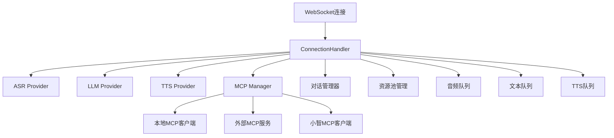

# WebSocket通讯抽象化评审报告

## 📋 项目概述

**项目名称**: 小智语音助手服务端  
**项目类型**: 基于WebSocket的实时语音处理系统  
**评审目标**: 评估将WebSocket相关通讯抽象为独立服务的可行性  
**评审日期**: 2025年1月

## 🏗️ 当前架构分析

### 项目整体结构

```
src/
├── core/
│   ├── transport/           # 传输层
│   │   ├── websocket/      # WebSocket实现
│   │   ├── interface.go    # 传输层接口定义
│   │   └── manager.go      # 传输管理器
│   ├── connection.go       # 连接处理核心逻辑
│   ├── mcp/               # MCP协议实现
│   ├── providers/         # AI服务提供者
│   │   ├── asr/          # 语音识别
│   │   ├── llm/          # 大语言模型
│   │   └── tts/          # 语音合成
│   └── pool/             # 资源池管理
├── configs/              # 配置管理
└── web/                 # 前端界面
```

### WebSocket实现架构

#### 1. 传输层设计
- **WebSocketTransport**: 实现了`Transport`接口，负责WebSocket服务的启动和管理
- **WebSocketConnection**: 管理单个WebSocket连接的生命周期
- **TransportManager**: 统一管理多种传输协议

#### 2. 连接处理层
- **ConnectionHandler**: 核心业务逻辑处理器，包含：
  - 音频流处理（PCM/Opus格式）
  - 文本消息处理
  - MCP协议消息处理
  - 对话状态管理
  - 多模态交互支持

#### 3. 消息类型支持
- `hello`: 客户端握手和参数协商
- `listen`: 语音监听控制
- `chat`: 文本对话消息
- `abort`: 中断当前对话
- `mcp`: MCP协议消息
- `vision`: 视觉相关消息
- `iot`: IoT设备消息

## 🔍 依赖关系分析

### 核心依赖关系图



### 耦合度分析

#### 高耦合组件
1. **ConnectionHandler与AI提供者**: 直接持有ASR、LLM、TTS提供者的引用
2. **消息处理与连接生命周期**: 消息处理逻辑与WebSocket连接紧密绑定
3. **状态管理与连接**: 对话状态、音频队列等与连接对象直接关联

#### 中等耦合组件
1. **MCP协议处理**: 虽然有独立的Manager，但仍需要连接对象进行消息发送
2. **资源池管理**: 通过工厂模式实现了一定程度的解耦

#### 低耦合组件
1. **传输层接口**: 良好的接口抽象，支持多种传输协议
2. **配置管理**: 独立的配置系统

## ⚖️ 抽象可行性评估

### 技术可行性: ⭐⭐⭐⭐☆ (4/5)

#### 优势
1. **良好的接口设计**: 传输层已有`Transport`接口抽象
2. **模块化架构**: 各AI提供者相对独立
3. **配置驱动**: 支持多种AI服务配置切换
4. **资源池化**: 已实现资源池管理机制

#### 挑战
1. **实时性要求**: 语音处理对延迟极其敏感（<100ms）
2. **状态管理复杂**: 大量会话状态需要在服务间同步
3. **消息路由复杂**: 多种消息类型需要智能路由
4. **错误处理**: 分布式环境下的错误处理更复杂

### 业务价值: ⭐⭐⭐☆☆ (3/5)

#### 潜在收益
1. **独立扩展**: 各服务可根据负载独立扩展
2. **技术栈灵活**: 不同服务可使用不同技术栈
3. **故障隔离**: 单个服务故障不影响整体系统
4. **开发效率**: 团队可并行开发不同服务

#### 成本考虑
1. **开发成本**: 需要重新设计架构和接口
2. **运维成本**: 分布式系统的监控和运维复杂度增加
3. **性能成本**: 网络调用可能影响实时性
4. **学习成本**: 团队需要掌握分布式系统技能

## 🎯 推荐方案

### 方案选择: 渐进式重构 + 混合架构

基于分析结果，**不建议完全抽象**，推荐采用**渐进式重构**的方式：

#### 阶段一: MCP服务抽象 (推荐优先级: ⭐⭐⭐⭐⭐)
```
当前: WebSocket -> ConnectionHandler -> MCP Manager
目标: WebSocket -> MCP Service (HTTP/gRPC)
```

**实施要点**:
- 将MCP处理逻辑抽象为独立的HTTP/gRPC服务
- WebSocket服务通过API调用MCP服务
- 保持MCP消息的异步处理特性

**收益**:
- MCP功能相对独立，抽象风险低
- 支持多个WebSocket实例共享MCP服务
- 便于MCP功能的独立开发和测试

#### 阶段二: 会话管理服务抽象 (推荐优先级: ⭐⭐⭐⭐☆)
```
当前: ConnectionHandler内部状态管理
目标: 独立的会话管理服务 + Redis缓存
```

**实施要点**:
- 抽象对话历史、用户状态管理
- 使用Redis作为会话状态存储
- 支持多设备会话同步

**收益**:
- 支持用户跨设备的会话连续性
- 便于实现会话持久化和恢复
- 减少WebSocket服务的内存占用

#### 阶段三: 业务逻辑优化 (推荐优先级: ⭐⭐⭐☆☆)
```
当前: 紧耦合的业务逻辑
目标: 松耦合的事件驱动架构
```

**实施要点**:
- 引入进程内消息总线（如Go的channel或事件系统）
- 保持核心AI处理逻辑在同一进程内
- 通过事件解耦各模块间的直接依赖

**收益**:
- 提高代码的可测试性和可维护性
- 为未来的服务化做好准备
- 保持实时性能要求

### 不推荐的方案

#### ❌ 完全服务化
- **原因**: 实时语音处理对延迟极其敏感
- **风险**: 网络延迟可能导致用户体验下降
- **复杂度**: 分布式状态管理复杂度过高

#### ❌ 大爆炸式重构
- **原因**: 风险过高，影响业务连续性
- **建议**: 采用渐进式重构，逐步验证效果

## 📊 实施建议

### 技术实施路径

#### 1. 准备阶段 (1-2周)
- [ ] 完善单元测试覆盖率
- [ ] 建立性能基准测试
- [ ] 设计服务间通讯协议
- [ ] 准备监控和日志系统

#### 2. MCP服务抽象 (2-3周)
- [ ] 设计MCP服务API接口
- [ ] 实现MCP服务独立部署
- [ ] 修改WebSocket服务调用方式
- [ ] 性能测试和优化

#### 3. 会话管理抽象 (3-4周)
- [ ] 设计会话状态数据模型
- [ ] 实现Redis会话存储
- [ ] 修改连接处理逻辑
- [ ] 多设备会话测试

#### 4. 架构优化 (持续进行)
- [ ] 引入事件驱动机制
- [ ] 优化模块间接口
- [ ] 性能监控和调优
- [ ] 文档和培训

### 风险控制措施

#### 性能风险
- **监控指标**: 延迟、吞吐量、错误率
- **回滚机制**: 保持原有架构的可快速回滚能力
- **灰度发布**: 逐步切换流量到新架构

#### 稳定性风险
- **熔断机制**: 实现服务间的熔断保护
- **重试策略**: 合理的重试和超时配置
- **降级方案**: 关键功能的降级处理

#### 开发风险
- **接口版本管理**: 向后兼容的API设计
- **测试策略**: 完善的集成测试和端到端测试
- **文档维护**: 及时更新架构和接口文档

## 📈 预期收益与成本

### 收益评估

#### 短期收益 (3-6个月)
- MCP功能的独立开发和部署
- 代码结构的清晰化和可维护性提升
- 团队开发效率的提升

#### 长期收益 (6-12个月)
- 支持更大规模的并发用户
- 多设备会话同步能力
- 为AI能力的快速迭代提供基础

### 成本评估

#### 开发成本
- **人力投入**: 2-3名开发人员，3-4个月
- **测试成本**: 完善的测试用例和自动化测试
- **文档成本**: 架构文档和接口文档的编写

#### 运维成本
- **基础设施**: Redis缓存、负载均衡器
- **监控系统**: 分布式链路追踪、性能监控
- **运维人力**: 分布式系统的运维技能培训

## 🎯 结论与建议

### 总体结论

**WebSocket通讯的部分抽象是可行的，但需要谨慎实施**。考虑到项目的实时性要求和当前架构的合理性，建议采用**渐进式重构**的方式，优先抽象风险较低、收益明显的MCP服务。

### 核心建议

1. **优先级排序**: MCP服务 > 会话管理 > 核心AI服务
2. **性能优先**: 任何抽象都不应影响实时语音处理的性能
3. **渐进实施**: 分阶段实施，每个阶段都要充分验证
4. **监控完善**: 建立完善的性能监控和告警机制
5. **团队准备**: 确保团队具备分布式系统的开发和运维能力

### 决策建议

- **如果团队规模较小** (< 5人): 建议暂缓抽象，专注于功能完善
- **如果并发需求不高** (< 1000连接): 当前架构已足够支撑
- **如果追求技术先进性**: 可以从MCP服务开始尝试抽象
- **如果业务快速发展**: 建议优先考虑会话管理的抽象

---

**评审人**: AI助手  
**评审日期**: 2025年1月  
**文档版本**: v1.0  

> 本报告基于对项目代码的深入分析，建议在实施前进行更详细的性能测试和团队技术能力评估。